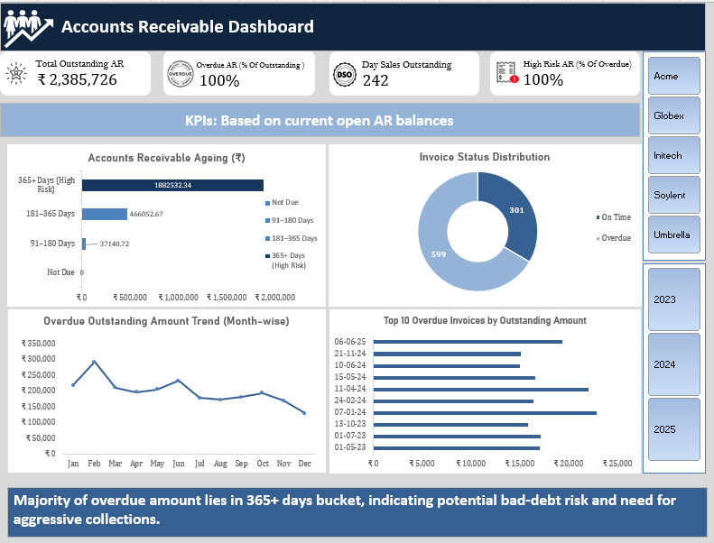

## Excel Sales & Accounts Receivable Dashboard

### Project Overview
This project focuses on analyzing sales performance and accounts receivable data using Microsoft Excel.

### Dashboard Preview

### Business Objective
To help finance teams monitor overdue receivables, identify high-risk customers, and improve collection efficiency through data-driven insights.

### Key Features
- Interactive dashboards using Pivot Tables and Pivot Charts
- Data cleaning and transformation using Power Query
- KPI tracking including Revenue Trends, DSO, AR Ageing, and Overdue Risk
- Business-focused reporting and insights

### Tools Used
- Microsoft Excel
- Power Query
- Pivot Tables & Charts

### Files
- RESUME PROJECT 1.xlsx – Sales Performance Dashboard
- Accounts-Receivable.xlsx – AR Analytics Dashboard
